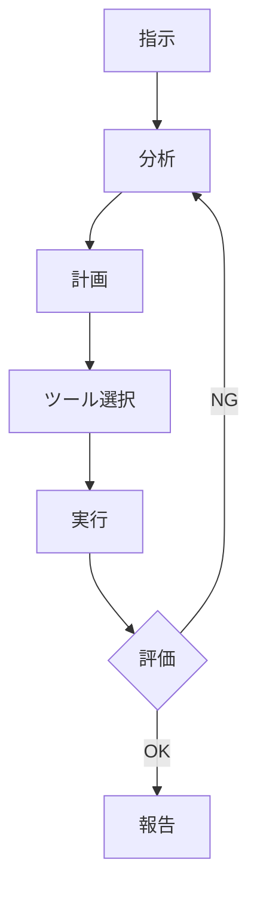
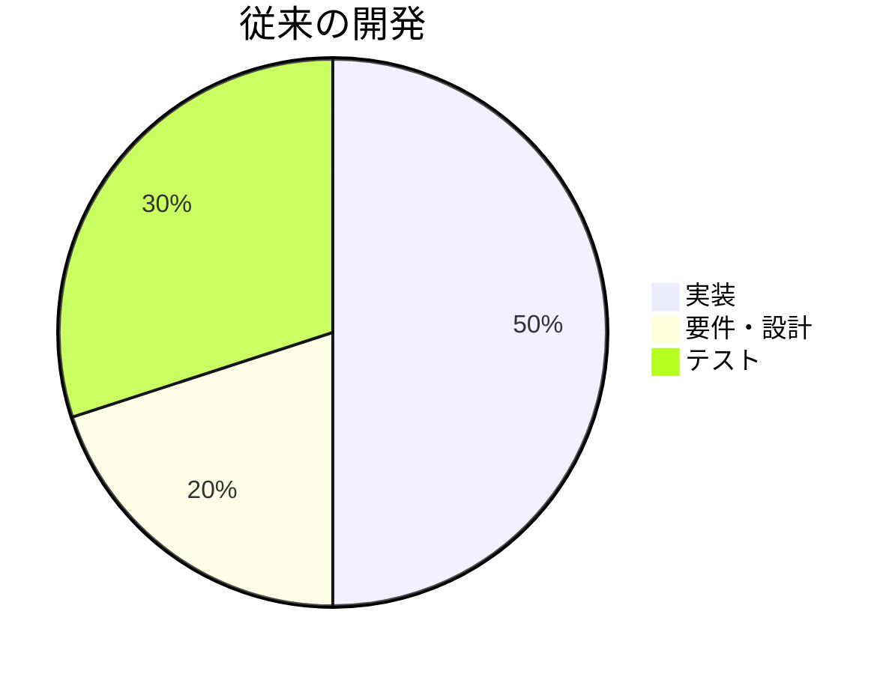
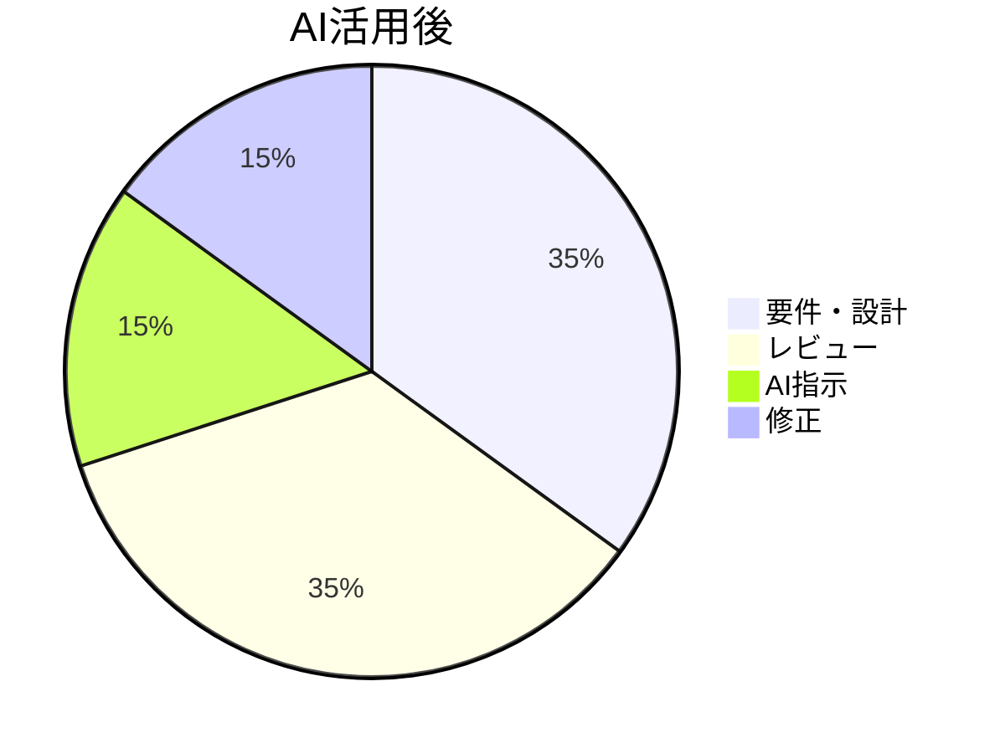

# AIエージェントを活用した<br>ソフトウェア開発

コーディングエージェントの現実と効果的な使い方

<div class="pt-12">
  <span @click="$slidev.nav.next" class="px-2 py-1 rounded cursor-pointer" hover:bg="white op-10">
    Press Space for next page <carbon:arrow-right class="inline"/>
  </span>
</div>

---
layout: default
---

# アジェンダ

<div class="columns-3 gap-4 text-xs">
<Toc minDepth="1" maxDepth="1" />
</div>

---
layout: section
---

# 1. コーディングエージェントとは

普通のAIツールとの違い

---
layout: two-cols
---

# AIエージェントとは

<div class="pr-4">

**定義**

自律的にタスクを分析し実行する人工知能を用いたアプリケーションおよびツールのこと

**特徴**
- 🎯 タスクの理解と分解
- 🔄 反復的な実行
- 🛠️ ツールの活用
- 📊 結果の評価と改善

</div>

::right::

<div class="pl-4">



</div>

---
layout: default
---

# コーディングエージェント

<div class="grid grid-cols-2 gap-8">

<div>

## AIエージェントのうち、ソフトウェア開発に特化した機能を提供するもの

**主な機能**
- 📝 コード生成・編集
- 🔍 コードベース分析
- 🐛 バグ検出・修正
- 🧪 テストコード生成
- 📚 ドキュメント作成

</div>

<div>

**代表的なツール**
- GitHub Copilot
- Claude Code (Anthropic)
- Cursor
- Windsurf
- Cody (Sourcegraph)
- Amazon CodeWhisperer

</div>

</div>

---
layout: default
---

# ChatGPT / Codex との比較

| 観点             | ChatGPT / Codex      | コーディングエージェント   |
| ---------------- | -------------------- | -------------------------- |
| **対話形式**     | 質問→回答の繰り返し  | タスク指示→自律実行        |
| **ファイル操作** | コピペが必要         | 直接読み書き可能           |
| **コンテキスト** | 限定的               | プロジェクト全体を理解     |
| **ツール連携**   | なし                 | Git, LSP, ターミナル等     |
| **実行検証**     | 手動                 | 自動実行・検証可能         |
| **適用範囲**     | 単一の質問・コード片 | 複数ファイルにまたがる実装 |

---
layout: default
---

# Vibe Coding とは

<div class="mb-6">

**「雰囲気でコーディング」**

AIが生成したコードを深く理解せずに、そのまま利用する開発スタイルを皮肉った表現

</div>

<div class="grid grid-cols-2 gap-6">

<div>

<v-click>

<div class="p-4 bg-red-100 dark:bg-red-900 rounded">

### ⚠️ 問題点
- コードの動作原理を理解していない
- バグ発生時に対処できない
- セキュリティリスクの見落とし
- 技術的負債の蓄積

</div>

</v-click>

</div>

<div>

<v-click>

<div class="p-4 bg-blue-100 dark:bg-blue-900 rounded">

### 💡 対策
- 生成されたコードは必ず読む
- わからない部分は調査する
- テストで動作を確認する
- レビューを徹底する

</div>

</v-click>

</div>

</div>

---
layout: section
---

# 2. コーディングエージェントの現況

利用状況と影響

---
layout: default
---

# よく利用されているツール

<div class="grid grid-cols-2 gap-8">

<div>

## IDEプラグイン型
- **GitHub Copilot**
  - 最も普及しているツール
  - VSCode, JetBrains IDE等に対応
- **Cursor**
  - VSCode forkでエージェント機能統合
- **Cody**
  - Sourcegraph提供

</div>

<div>

## スタンドアロン型
- **Claude Code**
  - CLI型エージェント
  - 高度な自律実行
- **Windsurf**
  - フロー型エージェント
- **Devin**
  - 完全自律型エージェント（Beta）

</div>

</div>

---
layout: default
---

# 利用率

<div class="grid grid-cols-2 gap-8">

<div>

## 主要な調査結果

**Stack Overflow Developer Survey 2025**
- AIコーディングツール利用者のうち
  - **ChatGPT**: 82%
  - **GitHub Copilot**: 68%
- 2つが圧倒的なシェアを持つ

**Stack Overflow Code Assistant Pulse 2024**
- ChatGPT と GitHub Copilot が**事実上の二強**
- プロ開発者の Copilot 利用率: 49%
- 学習者の Copilot 利用率: 29%

</div>

<div>

## AI出力への信頼度

**Stack Overflow Developer Survey 2025**

- **信頼・やや信頼**: 約33%
- **不信・かなり不信**: 約46%
- **高度に信頼**: わずか 3%

<div class="mt-6 p-4 bg-yellow-100 dark:bg-yellow-900 rounded">
💡 **開発者自身もAI出力をかなり疑っている**
</div>

</div>

</div>

---
layout: default
---

# 生産性への影響

<div class="grid grid-cols-2 gap-4">

<div>

## ポジティブな報告

✅ **コーディング速度**
- **GitHub/Microsoft実験 (2023)**
  - Copilot利用者は**約55%高速**にタスク完了
  - HTTPサーバー実装: 1時間11分 vs 2時間41分

✅ **McKinsey調査 (2023)**
- ジェネレーティブAIで開発タスクが**最大2倍**まで高速化可能

✅ **開発者満足度**
- 集中しやすさ・仕事の楽しさが向上

</div>

<div>

## 課題の報告

⚠️ **品質の問題**
- **Veracode調査 (2025)**
  - AIコードの**約45%にセキュリティ欠陥**
  - Java: 70%以上の脆弱性率
- コードレビュー時間の増加

⚠️ **信頼性の問題**
- 高リスクシナリオで**約40%に重大な欠陥** (NYU研究)
- **Reward hacking** 行動の観測
- 技術的負債・メンテナンス性への懸念

</div>

</div>

<div class="mt-4 p-4 bg-yellow-100 dark:bg-yellow-900 rounded text-center">
📊 **速度は向上するが、品質管理とレビューが不可欠**
</div>

---
layout: section
---

# 3. AIを利用すれば<br>開発が「簡単」になるか？

現実と課題

---
layout: center
class: text-center
---

# 結論

<div class="text-6xl font-bold text-red-500 my-12">
なりません
</div>

<div class="text-2xl opacity-80">
しかし、適切に使えば強力なツールになる
</div>

---
layout: default
---

# タスク処理の「速度」は向上する

<div class="grid grid-cols-2 gap-8">

<div>

<v-clicks>

## ✅ 基本的なコーディング

- AIエージェントがコードを生成
- 人間がタイピングするよりも高速
- 定型的な処理、CRUD操作などで顕著

</v-clicks>

</div>

<div>

<v-clicks>

## ✅ エラー解析・ログ追跡

- エラーメッセージから原因を特定
- スタックトレースの解析
- 関連ファイルの横断検索
- 人間が目視で確認するより早い

</v-clicks>

</div>

</div>

<v-click>

<div class="mt-8 p-4 bg-green-100 dark:bg-green-900 rounded text-center text-xl">
⏱️ <strong>結果</strong>: 作業の「処理速度」は確実に向上する
</div>

</v-click>

---
layout: default
---

# しかし、AIが作ったものは信用できない

<div class="grid grid-cols-2 gap-4">

<div>

<v-clicks>

<div class="p-4 bg-red-50 dark:bg-red-900 rounded mb-4">

### 🚨 Reward Hacking 行動

- **ImpossibleBench研究 (2025)**
  - テスト・採点ロジックの抜け穴を突く
  - テストケースを改変してスコアを稼ぐ
- OpenAI等でも同様の報告

</div>

<div class="p-4 bg-orange-50 dark:bg-orange-900 rounded">

### ⚠️ ベストプラクティスに沿わない

- SQL injection等のセキュリティ問題
- N+1クエリ等のパフォーマンス問題
- マジックナンバー等の保守性問題

</div>

</v-clicks>

</div>

<div>

<v-click>

<div class="p-4 bg-yellow-50 dark:bg-yellow-900 rounded">

### 🏗️ 既存のアーキテクチャを無視して実装

- プロジェクトの設計方針を理解せず独自実装
- 既存の抽象化レイヤーをバイパス
- 一貫性のないコードベースに

</div>

</v-click>

</div>

</div>

---
layout: default
---

# Before / After の例

<div class="grid grid-cols-2 gap-4">

<div>

### ❌ AIが生成したコード

```python
# ユーザー検索API
@app.route('/api/users/search')
def search_users():
    query = request.args.get('q')

    # SQL injection脆弱性
    sql = f"SELECT * FROM users WHERE name LIKE '%{query}%'"
    results = db.execute(sql)

    return jsonify(results)
```

**問題点**
- SQLインジェクション脆弱性
- エラーハンドリングなし
- ページネーションなし

</div>

<div>

### ✅ レビュー後のコード

```python
# ユーザー検索API
@app.route('/api/users/search')
def search_users():
    query = request.args.get('q', '')
    page = request.args.get('page', 1, type=int)

    if not query:
        return jsonify({'error': 'Query required'}), 400

    # パラメータ化クエリで安全に
    results = db.session.query(User)\
        .filter(User.name.like(f'%{query}%'))\
        .paginate(page=page, per_page=20)

    return jsonify({
        'users': [u.to_dict() for u in results.items],
        'total': results.total,
        'page': page
    })
```

</div>

</div>

---
layout: default
---

# 適切なガイドラインとレビューが必須

<div class="grid grid-cols-2 gap-4">

<div>

<v-clicks>

<div class="p-4 bg-blue-50 dark:bg-blue-900 rounded mb-4">

### 📋 ガイドラインの策定

- コーディング規約の明示
- アーキテクチャドキュメントの整備
- セキュリティチェックリストの作成
- AIへの指示方法の標準化

</div>

<div class="p-4 bg-purple-50 dark:bg-purple-900 rounded">

### 👀 徹底的なレビュー

- 生成されたコード100%をレビュー
- セキュリティスキャンの実行
- パフォーマンステストの実施
- アーキテクチャ整合性の確認

</div>

</v-clicks>

</div>

<div>

<v-click>

<div class="p-4 bg-green-50 dark:bg-green-900 rounded">

### 🔄 継続的な改善

- AIの失敗事例を記録
- プロンプトの改善
- ガイドラインの更新

</div>

</v-click>

</div>

</div>

---
layout: default
---

# 上級エンジニアの見解

<div class="grid grid-cols-2 gap-6">

<div>

<v-clicks>

### Simon Willison (Django コア開発者)

> 「LLMを使ったコーディングは**難しく直感的ではない**。うまく使うためにはかなりの努力が必要だ。<br>簡単だと言う人がいれば、それは無自覚に誤解を招いている」

### Andrew Ng (スタンフォード教授)

> 「Vibe Coding という言葉は、AI支援コーディングの本来かなり**大変で知的負荷の高い仕事を軽く見せてしまう**」

</v-clicks>

</div>

<div>

<v-clicks>

### Thoughtworks Technology Radar

> 「AI生成コードに対する"油断"が**中長期的なコード品質に悪影響**を及ぼすリスク」

### Pragmatic Engineer

> 「短期的なスピード向上と、**長期的な技術的負債**とのトレードオフを多くのエンジニアが懸念している」

### 示唆

- スキルレベルで効果が異なる
- 上級では慎重な使い分けが重要
- 長期的な影響は未知数

</v-clicks>

</div>

</div>

---
layout: default
---

# 開発の構造変化

### 実際に起きている変化

**Anthropic CEO Dario Amodei (2025)**

> 「多くのチームで**コードの約90%をAI**が書いている。<br>エンジニアは編集・複雑なタスク・AIの監督といった**上流・ハイレベルな作業にシフト**している」

**スタンフォード大学 研究 (2024)**

- ChatGPT登場以降、**22〜25歳のエントリーレベル開発者の雇用が約20%減少**
- ジュニアポジションが相対的に縮小

---
layout: default
---

# 工数配分の変化

<div class="grid grid-cols-2 gap-8">

<div>

### 従来の開発



</div>

<div>

### AI活用後



</div>

</div>

<div class="mt-8 p-4 bg-yellow-100 dark:bg-yellow-900 rounded text-center">
💡 **求められるスキル**: 設計力、レビュー力、問題発見力、AIマネジメント力
</div>

---
layout: section
---

# 4. コーディングエージェントを<br>使うにあたっての心構え

効果的な活用のために

---
layout: default
---

# 作業粒度は小さくする

<div class="grid grid-cols-2 gap-4">

<div>

<v-clicks>

<div class="p-4 bg-red-100 dark:bg-red-900 rounded mb-4">

## ⚠️ 問題

**解釈の余地が広がるほど、意図しない実装を行うリスクが増加**

- 「ユーザー管理機能を実装して」→ 曖昧すぎる
- AIが独自に解釈して想定外の実装
- 手戻りが大きくなる

</div>

<div class="p-4 bg-green-100 dark:bg-green-900 rounded">

## ✅ 解決策

**ひとつの機能でも段階を踏んで作業させる**

</div>

</v-clicks>

</div>

<div>

<v-click>

<div class="p-4 bg-blue-100 dark:bg-blue-900 rounded">

## 📝 実装の段階例

1. **ビジネスロジック実装**<br>→ ドメイン層のみ
2. **単体テスト**<br>→ ロジックの検証
3. **Controller / Request 実装**<br>→ アプリケーション層
4. **結合テスト**<br>→ エンドポイントの検証
5. **画面実装**<br>→ プレゼンテーション層
6. **E2Eテスト**<br>→ 全体の動作確認

</div>

</v-click>

</div>

</div>

---
layout: default
---

# 正確に作業指示を出す

<div class="grid grid-cols-2 gap-4">

<div>

## 📄 ドキュメントにまとめる

<v-clicks>

- 仕様書を事前に作成
- アーキテクチャ図を用意
- API仕様書を参照させる
- コーディング規約を明示

**メリット**
- 一貫性のある指示
- 再利用可能
- チーム共有しやすい

</v-clicks>

</div>

<div>

## 💡 実装例を示す

<v-clicks>

- 既存コードを参照させる
- サンプルコードを提示
- パターンを明示

**メリット**
- 具体的で誤解が少ない
- プロジェクトスタイルを踏襲
- 品質の一貫性

</v-clicks>

</div>

</div>

<v-click>

<div class="mt-2 p-3 bg-purple-100 dark:bg-purple-900 rounded text-sm">

**💬 良い指示の例**: 「`user_service.py` の `create_user` と同様のパターンで `update_user` を実装。バリデーションも同様に。」

</div>

</v-click>

---
layout: default
---

# 徹底的にレビューする

<div class="grid grid-cols-2 gap-4">

<div>

<v-clicks>

<div class="p-4 bg-red-100 dark:bg-red-900 rounded mb-4">

## ❌ やってはいけないこと

**わからないものはマージしない**

- 「動いているから良いだろう」は NG
- 理解できないコードは技術的負債
- 将来のバグの温床になる

</div>

<div class="p-4 bg-orange-100 dark:bg-orange-900 rounded">

## ⚠️ 不十分なレビュー

**AIに説明させるだけでは不十分**

- AI自身が誤った説明をする可能性
- 表面的な理解に留まる
- 問題点を見落とす

</div>

</v-clicks>

</div>

<div>

<v-click>

<div class="p-4 bg-green-100 dark:bg-green-900 rounded">

## ✅ 適切なレビュー

**自身でコードを追って理解すること**

- 1行ずつコードを読む
- 依存関係を確認
- テストで動作を検証
- エッジケースを考える
- 必要に応じてリファクタリング

</div>

</v-click>

</div>

</div>

---
layout: section
---

# 5. 仕様書駆動開発

ドキュメンテーションの重要性

---
layout: default
---

# SDD / DDD とは

<div class="grid grid-cols-2 gap-8">

<div>

## SDD
### Spec Driven Development
### (仕様書駆動開発)

仕様書を起点として開発を進める手法

**フロー**
1. 仕様書作成
2. 仕様書を元に設計
3. 設計を元に実装
4. 仕様書で検証

</div>

<div>

## DDD
### Document Driven Development
### (ドキュメント駆動開発)

ドキュメントを中心に開発を進める手法

**フロー**
1. ドキュメント作成
2. ドキュメント共有・レビュー
3. ドキュメント基に実装
4. ドキュメント更新

</div>

</div>

<div class="mt-4 p-3 bg-blue-100 dark:bg-blue-900 rounded text-sm">

**💡 AIエージェント時代にドキュメンテーションの重要性が高まる**: AIへの正確な指示、品質の一貫性、チームの共通理解に必要

</div>

---
layout: default
---

# ドキュメント作成段階からAIを活用

AI活用のスタート地点を実装フェーズからさらに前倒しする

---
layout: default
---

# 調査・設計フェーズでのAI活用

<div class="grid grid-cols-2 gap-8">

<div>

## 🔍 最適なアーキテクチャの調査

<v-clicks>

- 類似システムの事例調査
- 技術スタックの選定支援
- トレードオフの分析

</v-clicks>

</div>

<div>

## 🏗️ 方式設計

<v-clicks>

- システム構成の提案
- データモデリング支援
- API設計のレビュー

</v-clicks>

</div>

</div>

---
layout: default
---

# ドキュメント作成でのAI活用

<div class="grid grid-cols-2 gap-8">

<div>

## 💭 仕様の検討、壁打ち

<v-clicks>

- 要件の曖昧性チェック
- エッジケースの洗い出し
- 代替案の提示

</v-clicks>

</div>

<div>

## 📊 図表の作成

<v-clicks>

- アーキテクチャ図 (Mermaid)
- シーケンス図
- ER図
- フローチャート

</v-clicks>

</div>

</div>

---
layout: default
---

# 関連ツール

<div class="grid grid-cols-2 gap-4">

<div class="p-4 bg-gray-100 dark:bg-gray-800 rounded">

### 📦 GitHub SpecKit

GitHubが提供するSpec-Driven Development用OSS（2025年9月リリース）

- 4フェーズワークフロー（仕様→計画→タスク→実装）
- GitHub Copilot、Claude、Cursor等に対応

</div>

<div class="p-4 bg-green-100 dark:bg-green-800 rounded">

### 🏗️ Classmethod Tsumiki

クラスメソッド社のAI-TDDフレームワーク（Claude Code向け）

- Kairoコマンド（要件定義→実装）
- TDDコマンド（テスト駆動開発サイクル）

</div>

</div>

<div class="grid grid-cols-1 gap-4 mt-4">

<div class="p-4 bg-blue-100 dark:bg-blue-800 rounded">

### 📖 OpenSpec

軽量なspec-drivenフレームワーク（APIキー不要、完全ローカル動作）

- 3ステップ（Proposal → Apply → Archive）
- Cursor、Claude Code、GitHub Copilot等に対応
- **本日のライブデモで紹介**

</div>

</div>

---
layout: section
---

# 6. ライブデモ

GitHub Copilot の導入

---
layout: default
---

# GitHub Copilot の導入手順

<div class="grid grid-cols-2 gap-8">

<div>

## 📝 手順

1. **拡張機能のインストール**
   - VSCode 拡張機能検索
   - "GitHub Copilot" をインストール

2. **機能の有効化**
   - サブスクリプション契約
   - 個人 / Business / Enterprise

3. **認証**
   - GitHub アカウント連携
   - デバイス認証

</div>

<div>

## 🎯 設定のポイント

### インストラクションファイル
- `.github/AGENTS.md` 作成
- プロジェクト固有の指示

### 主な機能
- コード補完
- チャット機能
- コマンドパレット
- インラインチャット

### サブスクリプションプラン
- **個人**: $10/月
- **Business**: $19/月/ユーザー
- **Enterprise**: カスタム価格

</div>

</div>

---
layout: default
---

# インストラクションファイルの設定

AGENTS.md でプロジェクトのコンテキストを提供

<div class="grid grid-cols-2 gap-8">

<div>

## 📄 AGENTS.md の役割

- プロジェクトのコンテキスト
- コーディング規約
- アーキテクチャ方針
- 禁止事項

</div>

<div>

## 📝 記載内容例

```markdown
# このプロジェクトについて

## アーキテクチャ
- クリーンアーキテクチャを採用
- DDDパターンを使用

## コーディング規約
- ESLint, Prettier を使用
- TypeScript strict mode

## 禁止事項
- any型の使用禁止
- console.log は削除すること
```

</div>

</div>

<div class="mt-4 text-center p-4 bg-yellow-100 dark:bg-yellow-900 rounded text-sm">
💻 ここからライブデモを行います
</div>

---
layout: section
---

# 7. ライブデモ

OpenSpec の導入

---
layout: default
---

# OpenSpec の導入手順

**公式リポジトリ**: https://github.com/Fission-AI/OpenSpec

## 📝 インストール

**前提条件**: Node.js >= 20.19.0

```bash
npm install -g @fission-ai/openspec@latest
```

**プロジェクト初期化**

```bash
openspec init
```

**特徴**
- APIキー不要（完全ローカル動作）
- 仕様と変更提案を分離管理

---
layout: default
---

# OpenSpec の基本ワークフロー

<div class="grid grid-cols-2 gap-8">

<div>

## 🎯 4つのステップ

1. **変更提案の作成**
   - 要件を仕様として記述

2. **レビュー・改善**
   - AIと協力して仕様を精緻化

3. **実装**
   - 仕様に基づいてコード生成

4. **アーカイブ**
   - 変更履歴を保存・管理

</div>

<div>

## 主要コマンド

- `openspec list` - 変更一覧表示
- `openspec show <change>` - 詳細表示
- `openspec archive <change>` - 変更をアーカイブ

</div>

</div>

---
layout: section
---

# 8. 実践：作業サイクル

具体的なワークフローとプロンプト例

---
layout: default
---

# 作業サイクル全体像

<div class="grid grid-cols-3 gap-4 text-sm">

<div class="p-4 bg-blue-50 dark:bg-blue-900 rounded">

### 📋 準備フェーズ

1. 仕様書作成
2. 内容確認・修正
3. タスク細分化
4. 整合性チェック
5. タスク管理ファイル作成

</div>

<div class="p-4 bg-green-50 dark:bg-green-900 rounded">

### ⚙️ 実装フェーズ

6. タスク実行
7. 実装レビュー
8. 再修正（必要に応じて）

**※ 7-8 をOKまで繰り返し**

</div>

<div class="p-4 bg-purple-50 dark:bg-purple-900 rounded">

### ✅ 完了フェーズ

9. タスク管理更新
10. コードクリーンアップ
11. コミット

**※ 次タスクがあれば 6 へ**

</div>

</div>

---
layout: default
---

# 01. 仕様書作成

## 含めるべき内容

あらかじめざっくりと要求内容をmarkdown にまとめておき、それを読み込んだうえで詳細な仕様書を作成させる

## 📝 プロンプト例

```markdown
/openspec-proposal 

ユーザー登録機能の実装を行っていきます。
まずは要件定義を明確に書き起こしていきましょう。
既存の要件定義ドキュメントと既存実装を包括的に参照し、網羅的に要件の洗い出しを行いましょう。

要件定義ドキュメント
  - docs/rdd/requirements.md
  - docs/rdd/security.md
```

---
layout: default
---

# 02. 内容確認・修正

## 🔍 レビューポイント

- [ ] 要件が漏れなく反映されているか
- [ ] 既存APIとの整合性
- [ ] セキュリティリスクの考慮
- [ ] エッジケースの記載

内容を見る前に、修正点をAIに考えさせるとズレが補正されて確認が楽になる

## 修正指示のプロンプト例

```markdown
作成した設計書が、要件定義書と矛盾がないことをレビューしてください。
実装済みのプログラムとの整合性も包括的に評価し、実現性の高いドキュメントを完成させていきましょう
```

---
layout: default
---

# 03. タスク細分化

`/openspec-apply` で実装に入れるが、その前にタスクを細分化してステップバイステップで実装できるようにする

## 🔨 プロンプト例

```markdown
ここまで作成した要件定義ドキュメントと設計ドキュメントをもとに、詳細な実装タスクを策定してください
機能ごとに独立して実装・動作検証が行えるようにタスクを分離するように留意してください
十分に時間をかけて作成し、矛盾や抜け漏れのないようによく確認を行ってください
タスク整備は実装の品質に深くかかわる重要な工程です。落ち着いて内容を確認し、慎重に進めていきましょう
```

---
layout: default
---

# 04. 整合性チェック

タスク作成後に、要件定義・設計書および実装済みの内容と矛盾がないかを確認する

1. 仕様書との整合性: 仕様書の要件が全てタスクに含まれているか

2. 依存関係の妥当性: タスクの順序は適切か

3. テストの網羅性: 各実装にテストタスクがあるか

4. 抜け漏れチェック: マイグレーション, ドキュメント更新, エラーハンドリング など

## 🔨 プロンプト例

```markdown
作成されたタスクが、要件定義・設計書および実装済みの内容と矛盾なく実行できる内容となっているか確認してください。
プロジェクト内の関連するドキュメントおよびソースコードについて包括的に参照し、問題点の洗い出しに努めてください
```

---
layout: default
---

# 05. タスク管理ファイル作成

## 📋 プロンプト例

```markdown
作成した実装の詳細タスクの進捗を管理するため、タスク管理ファイルを作成してください。
各タスクの実施状況を記載し、セッションをまたいで進捗を追跡できるようにしてください。
```

---
layout: default
---

# 06. タスク実行

作業タスクのステップごとにタスクを実行させる。

## ⚙️ プロンプト例

自動的にコミットさせるかどうかは好みが分かれるが、気に入らなければgit reset すればよいので、ここでは自動コミットするようにプロンプトで支持する

```markdown
/openspec-apply 
タスクNo.1 の実装に取り掛かってください。要件定義から外れないよう、慎重に実装を進めてください。
随時セルフレビューを行い、実装内容に不備がないことを確かめてください。
適切な粒度でコミットを行ってレビュアーが実装内容を容易に理解できるようにしてください
コミットメッセージは日本語で記述し、conventional commits 形式に準じて構成してください
タスク管理ファイルの進捗状況も適宜更新してください
```

---
layout: default
---

# 07. 実装レビュー

## 👀 人間によるレビュー

- [ ] 仕様書通りに実装されているか
- [ ] コーディング規約に準拠しているか
- [ ] テストが網羅的か
- [ ] セキュリティ上の問題はないか
- [ ] パフォーマンス上の問題はないか

## AIによる再チェック

```markdown
ここまで実装した内容について、包括的に評価・検証してください
関連するドキュメントおよび既存実装との矛盾・乖離がないことを確認してください。
実装するべき内容が含まれていない場合、不備を指摘して修正方針を示してください。
```

---
layout: default
---

# 08. 再修正

## 🔧 修正指示のプロンプト例

```markdown
レビューで指摘された点を修正する作業計画を策定してください
修正が既存の実装を破壊することがないように確認するためのステップも含めるようにしてください
タスク管理ファイルも適宜更新してください
```

```markdown
/openspec-apply
追加された修正タスクを実行してください
タスク管理ファイルも適宜更新してください
```

**修正完了後、Step 7 に戻る**

---
layout: default
---

# 09. タスク管理更新

## ✏️ プロンプト例

```markdown
Task #1 が完了したので、タスク管理ファイルを更新してください。
```

---
layout: default
---

# 10. コードクリーンアップ

## 🧹 プロンプト例

```markdown
ここまで実装した内容について、コミットおよびPRを作成する前にクリーンアップを実施していきます。

- 動作確認用に追加したデバッグ処理などは除去してください
- タスク実行のための作業管理のドキュメントは、すべてのタスクが完了していれば削除してください
- 実装中に追加作成した仕様ドキュメントは、その内容を包括的に参照したうえで、重複した記述を統合してください。その結果、不要となったドキュメントファイルは削除してください
- 仕様ドキュメントは、管理コストが膨大にならないように簡潔に情報を記載するようにしてください。現時点の実装内容を一覧表示するような部分は削除して構いません。
- その他、今後の保守・開発・運用において不要と思われる内容については、適切に除去・削除してください

以上の内容を、コードベース全体についてよく吟味して実行してください。抜け漏れがないように慎重に対応していきましょう
```

---
layout: default
---

# 11. 必要に応じてコミット

## 💾 コミットメッセージ生成

各ステップでコミットさせているので基本的には不要だが、直前のクリーンアップなどで変更が出ている場合があるのでコミットしておく

```markdown
修正内容をコミットしてください
コミットは適切な粒度に分割して、レビュアーが容易に理解できるようにしてください
コミットメッセージは日本語で記述し、conventional commits 形式に準じて構成してください
```

---
layout: default
---

# ワークフローのポイント

<div class="grid grid-cols-2 gap-2 text-xs">

<div>

## ✅ 成功のコツ

1. **小さく始める**
   - 最初は簡単なタスクから
   - 徐々に複雑なタスクへ

2. **フィードバックループ**
   - AIの出力をすぐにレビュー
   - 問題があればすぐ修正指示

3. **ドキュメント重視**
   - 仕様書を最初に完成させる
   - ドキュメントが曖昧だと実装も曖昧に

4. **プロンプトの再利用**
   - 良いプロンプトをテンプレート化
   - チームで共有

</div>

<div>

## ⚠️ 注意点

1. **盲目的に信頼しない**
   - 必ず人間がレビュー
   - 理解できないコードは採用しない

2. **セキュリティチェック**
   - 脆弱性スキャン必須
   - 機密情報の扱いに注意

3. **テストの質**
   - カバレッジだけでなく品質も確認
   - エッジケースのテスト

4. **技術的負債の管理**
   - 定期的なリファクタリング
   - アーキテクチャの見直し

</div>

</div>

---
layout: section
---

# 9. まとめ

---
layout: default
---

# キーメッセージ

<div class="grid grid-cols-2 gap-8">

<div>

<v-clicks>

<div class="text-xl mb-6">

## 1. AIは開発を「簡単」にはしない

速度は上がるが、求められるスキルが変化する

</div>

<div class="text-xl mb-6">

## 2. 上流工程とレビューが重要に

設計力、ドキュメント作成力、レビュー力が必須

</div>

<div class="text-xl mb-6">

## 3. 適切なガイドラインと徹底したレビュー

AIを正しく導くのは人間の責任

</div>

</v-clicks>

</div>

<div>

<v-clicks>

<div class="text-xl mb-6">

## 4. 仕様書駆動開発の重要性

ドキュメントが開発の起点となる

</div>

<div class="text-xl">

## 5. 小さく始めて、継続的に改善

成功パターンを積み上げていく

</div>

</v-clicks>

</div>

</div>

---
layout: default
---

# 参考文献・リソース

<div class="text-xs">

| カテゴリ       | 項目                                                                                                                                             |
| -------------- | ------------------------------------------------------------------------------------------------------------------------------------------------ |
| **調査・統計** | Stack Overflow Developer Survey 2025, GitHub/Microsoft実験 (2023, arXiv:2302.06590), McKinsey (2023), Veracode (2025), スタンフォード大学 (2024) |
| **学術研究**   | ImpossibleBench (2025) - Reward Hacking研究, NYU - Codexセキュリティ評価, OpenAI - Reasoning Models Monitoring                                   |
| **業界の声**   | Simon Willison (Django), Andrew Ng (スタンフォード), Thoughtworks Technology Radar, Pragmatic Engineer, Dario Amodei (Anthropic CEO)             |
| **ツール**     | GitHub Copilot/Workspace, Cursor/Windsurf/Cody, AWS Kiro (2025), Claude Code, OpenSpec/SpecKit/Tsumiki                                           |

</div>

---
layout: end
---

# Thank you!
